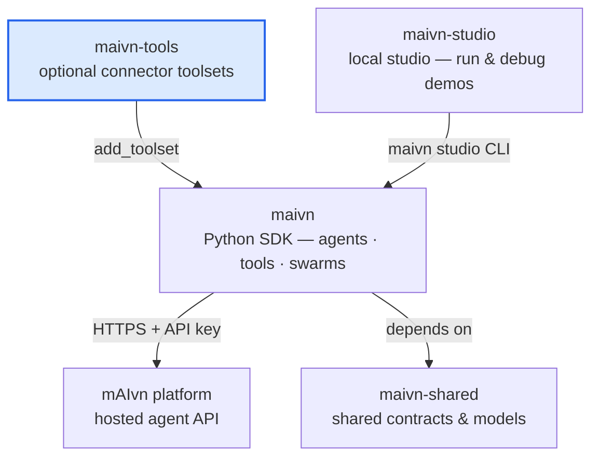

# mAIvn Tools

Official optional connector layer for the [mAIvn Python SDK](https://github.com/mAIvn-developer/maivn).

> [!warning]
> **Experimental — use with care.** `maivn-tools` is in early development
> (alpha). Connectors and toolsets are exercised against a mock transport in
> CI, but **most have not yet been validated end-to-end against live
> third-party provider APIs**. Request shapes, behavior, and the public surface
> may change between releases. Test against your own provider accounts before
> relying on any connector in production, and please
> [report issues](https://github.com/mAIvn-developer/maivn-tools/issues).

`maivn-tools` is a standalone PyPI package that depends on `maivn`. Installing it
pulls the SDK as well:

```bash
pip install maivn-tools
```

Some connectors need optional dependencies:

```bash
pip install "maivn-tools[pdf]"      # pypdf — PDF tooling
pip install "maivn-tools[docx]"     # python-docx — Word docs
pip install "maivn-tools[postgres]" # psycopg — Postgres connector
pip install "maivn-tools[all]"      # everything above
```

The package is not exposed as a `maivn[tools]` extra. That would create the same
circular release coupling we removed for `maivn[studio]` in 0.3.0; instead,
`maivn-tools` pins a compatible SDK version range directly.

## Ecosystem

`maivn-tools` is the optional connector layer in the **mAIvn** developer ecosystem. Learn more at
[maivn.io](https://maivn.io) — or dive into the developer hub at
[developer.maivn.io](https://developer.maivn.io).



## Development

```powershell
uv sync
uv run pytest
uv run ruff check .
uv run pyright
```

See [`docs/`](docs) for usage guides and [`docs/index.md`](docs/index.md) for the
documentation index.
